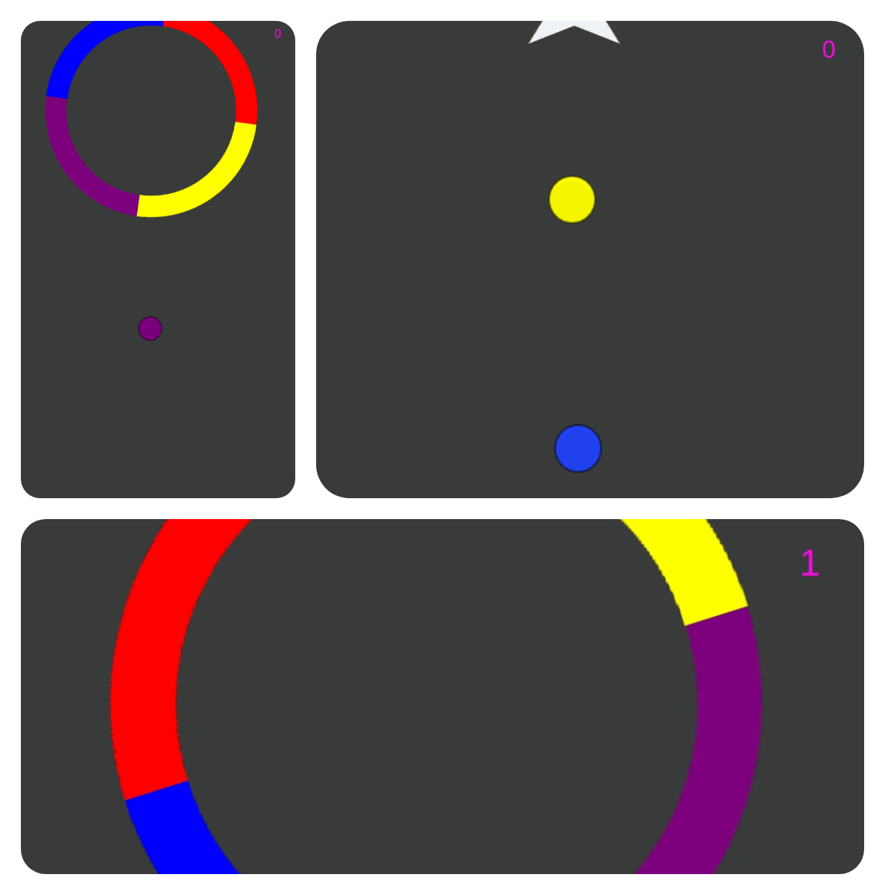

# Link : 
* 

* Link contains the game project.
* Video preview of the game.

# Screenshot : 

# Color-Switch-2D-Basic-implementation unity
* A famous 2D game with all the implpementation basically all done.
* Touch to jump.
* Colour change.
* Star Collection.
* Score Updation.
* Colliders functioning scripting done.
* Made for Android OS

# Aim
To replicate all the basic fucntionalities of the game colour switch.

# System Requirements
* Windows 10 pro
* Unity 2018(LTS)
* Visual Studios 17 or above
* Core i5 processors 7th gen or above.
* Dedicated GPU (Nvidia or AMD) Recomended.
* Android Phone for testing 
* Android Lollipop or above (Version 5.0 or above)

# Getting Started
Start by downloading the project from given link at the top.
Unity 2018 with (LTS) recomended or above
or
You can start by directly cloning the github repository into the folder of your choice

# To clone a github repo :
* Go to the github repository.
* Copy the https clone link in the code option.
* It should look like : https://github.com/VishalChangder00789/Color-Switch-Unity-Basic-implementation.git
* Now go to your local folder
* start git bash 
* type the command : < git clone "your copied url" > 
* It shoudl start cloning the github repository instantly.

* Visual Studio 2019 or 2019 is recommended, It is made to run on Windows OS (8,10).
* Unity 2018(LTS) is recomended.
* Basics of C# language.

# Main features to come:
* Different Levels.
* Stage Ending Logic.
* Implementation of Infinite Runner.

